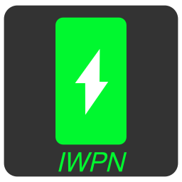

  
  
<i>Icon made by me</i>

  

### IWPN 
Stands For, Incredibly Lightweight Power Notify is my first ever python script, / project i've been working on, its a Power Notify system, script written in python, with only 66 lines of code!

# Showcase
<video src="iwpn-showcase.mp4" width="700" height="240" controls autoplay>
</video>

# Features

- Easy to install!
- Little to no cpu usage (tested)!
- Executable is only 8.6mb!
- Uses dunst to show notifications!
- Plays sound effect on notifications!
- An sound theming system now you can change sounds to whatever theme you like changed in config file!
- Can change battery level threshold in config file!

> # NOTE 1
  >Copyrighted sound themes such as Sonic, that was in the source code and windows 11, WILL not be included because it is not free for use, if you, want to install copyrighted themes go to my themes, repository to download and install themes.
  > # NOTE 2
  >See for theming instructions.

## Also See: [FAQ](Faq.md) for commonly asked questions and dont try to report already answered ones in issues!

# Installation

### 1 Run this command
    sh -c "$(curl -fsSL https://raw.githubusercontent.com/1nhp/IWPN-Python-Script/refs/heads/release/install.sh)"